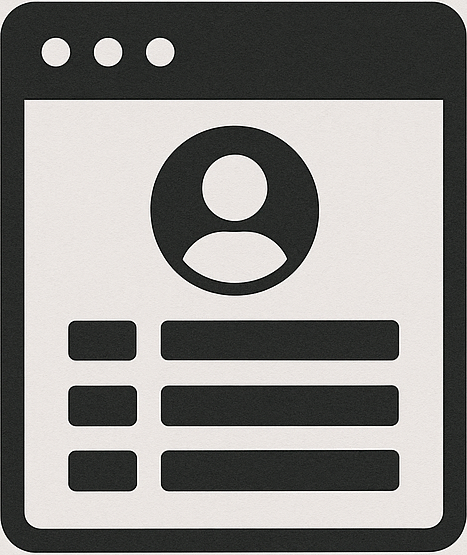

    <h1>
        

            
        

        Personal Developer Portfolio Website 📖
         
        
            Portfolio Website in Python and Flask 🎨
        
         
        
        
        
        
    </h1>

This repository contains code to build a simple developer portfolio website written in Python and Flask.

## Development 🔧

Contributions are welcome!

Please fork the repository and submit a pull request.

Make sure to follow the coding standards and write tests for any new features or bug fixes.
